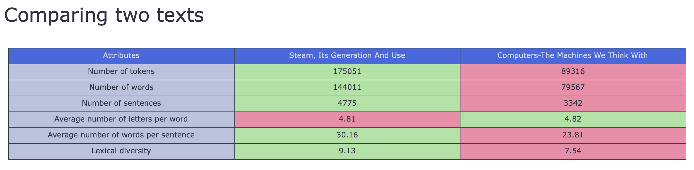

# Little Text Comparator

### What does it do?
Using `Python` and `NLTK`, this program analyzes and compares two different texts. It then generates graphs for better data visualization with `Plotly` and `Matplotlib`.

### Why this project?
This project was a way to start learning NLP basics, while doing some data visualization.

### Features and demo
The analysis includes:
- number of words,
- number of sentences,
- average number of letters per word,
- average number of words per sentence,
- lexical diversity,
- POS tagging.

##### Tables:

A green box means a higher value compared to the other text.

##### Pie charts:

### What I learned
I learned the basics of NLP:
- file preprocessing,
- simple tokenization and POS tagging,
- counting words and sentences.

More generally:
- working with multiple classes,
- simple error handling,
- imports,
- creating pie charts and tables,
- making API calls with `requests`

I refactored the project before publishing it. The first version worked, but this one has a better separation of responsibilities.

### How to use
##### Installation and setup
1. Create a virtual environment: 
    `python -m venv .venv`

2. Activate it: 
    macOS / Linux: `source .venv/bin/activate`
    Windows: `.venv\Scripts\Activate.ps1`

3. Install dependencies: `pip install -r requirements.txt`

##### Running the program
You have two options: using your own texts or using random ones.

###### With your texts: 
Please place your texts in the `Texts` folder as `.txt` files. For example: 

```
Texts/
├── my_first_text.txt
└── my_second_text.txt
```

Your texts must not be empty or corrupted.
Then, run `python main.py`. After pressing `s` to start, please enter `custom` and follow the instructions. When asked, enter the exact filename. For example: `Steam, Its Generation and Use` or `Computers-the machines we think with` without the `.txt` extension.

The program includes four texts from Project Gutenberg as examples.

###### With random texts:
How does it work? After pressing `s` to start, please enter `random` to work with random texts. This part of the program sends two API requests to Gutendex.com, and then gets two random texts to work with. 
Some texts may not contain all the information required by the program, which can cause an error. For example, a text may have no author or may be in an unsupported format.

### Possible improvements
1) improve tokenization around punctuation,
2) handle unsupported Gutendex texts gracefully,
3) improve CLI usability,
4) add more NLP metrics,
5) improve error handling.

### Credits
Natural Language Processing with Python, by Steven Bird, Ewan Klein, and Edward Loper. Copyright 2009 Steven Bird,
Ewan Klein, and Edward Loper, 978-0-596-51649-9.

[Project Gutenberg](https://www.gutenberg.org/) — Source for the four example texts included with the project.

[Gutendex](https://gutendex.com/) — API used to retrieve random Project Gutenberg texts.

### License
This project is under the MIT license.
